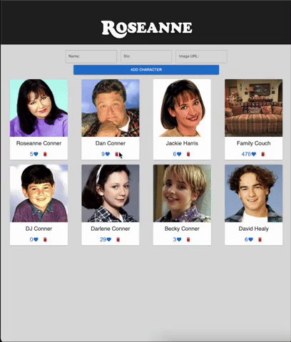

# REACT GALLERY

## Description

_Duration: 12 hours_

This was one of the first applications I made, 10 weeks into learning how to code. I had just learned React.js in only three days.

I was asked to create an application that displayed a gallery of photos, with functionality to like and delete photos, as well as a form to add additional photos. Being the dork i am, I decided to make it Roseanne themed.

On page load, a gallery of photos are fetched from a database and are rendered to the webpage. The user has the ability to like and delete photos, as well as add their own photos and descriptions. Once and image is clicked, the view toggles to the description view- if clicked again it will go back to image view.  When creating apps its of utmost importance to me to keep the UI intuitive, and I love when webpages resemble real life items. 

## Demo

## Built With

-MaterialUI
-CSS 
-Node.js 
-React.js
-postgreSQL

## Acknowledgement
Thanks to [Prime Digital Academy](www.primeacademy.io) who equipped and helped me to make this application a reality. Huge thanks to my peers in the Gaiman cohort for their unwavering support- I couldn't have done it without them. Hugs and love to my friends and family for being patient with me while I immersed myself in the software world and had little time for anything else. 

## Support
If you have suggestions or issues, please email me at jmbranstrator@gmail.com
